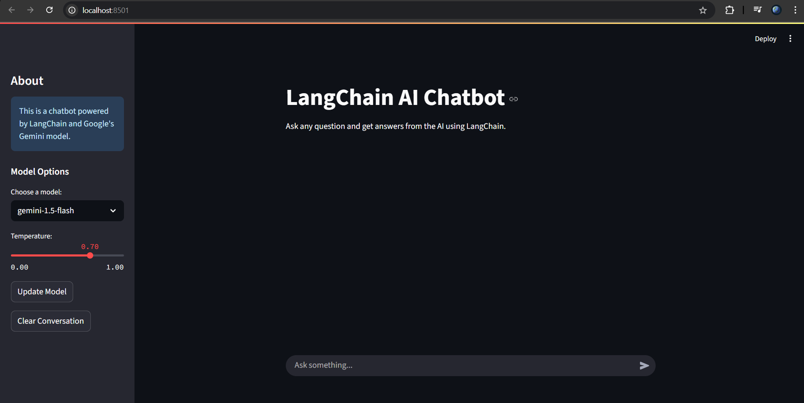

# Gemini AI Chatbot


A sophisticated, interactive chatbot powered by Google's Gemini AI models, built with LangChain and Streamlit. This application provides an intuitive interface for conversing with cutting-edge AI models directly from your browser.

## 📋 Features

- **Advanced AI Conversations**: Leverage Google's powerful Gemini models for natural, human-like interactions
- **Model Selection**: Choose between different Gemini model variants based on your needs
- **Adjustable AI Parameters**: Control the temperature (creativity level) of AI responses
- **Conversation Management**: Easily clear or review your chat history
- **User-Friendly Interface**: Clean, responsive design built with Streamlit
- **Local Deployment**: Run everything on your local machine for privacy

## 🖼️ Screenshots



## 🚀 Installation

### Prerequisites

- Python 3.8 or higher
- pip (Python package installer)

### Setup

1. Clone this repository:
   ```bash
   git clone https://github.com/yourusername/gemini-chatbot.git
   cd gemini-chatbot
   ```

2. Install required dependencies:
   ```bash
   pip install -r requirements.txt
   ```

3. Set up your Google API key:
   - Obtain an API key from [Google AI Studio](https://makersuite.google.com/)
   - Create a `.env` file in the project root directory
   - Add your API key: `GOOGLE_API_KEY=your_api_key_here`

## 💻 Usage

The easiest way to run the chatbot is:

### Using the Batch File (Windows)

Simply double-click the `start_chatbot.bat` file in Windows Explorer or run it from Command Prompt:

```bash
start_chatbot.bat
```

This will automatically launch the application in your default web browser at `http://localhost:8501`.

### Alternative Methods

If needed, you can also run the application using:

```bash
# Using the run_streamlit batch file
run_streamlit.bat chatbot.py

# OR using Python directly
python -m streamlit run chatbot.py
```

## 🛠️ Troubleshooting

If you encounter any issues:

1. Ensure all dependencies are installed:
   ```bash
   pip install -r requirements.txt
   ```
   
   Or install individual packages:
   ```bash
   pip install streamlit langchain langchain-google-genai python-dotenv
   ```

2. Verify your API key is correctly set up in the environment variables or .env file

3. Check console output for specific error messages

4. For model-specific errors, confirm your API key has access to the Gemini models

## 🧩 Project Structure

```
gemini-chatbot/
│
├── chatbot.py              # Main application file
├── start_chatbot.bat       # Windows batch file for easy startup (USE THIS TO RUN)
├── run_streamlit.bat       # Helper batch file used by start_chatbot.bat
├── requirements.txt        # Project dependencies
├── .env                    # Environment variables (API keys)
├── img/                    # Folder containing application screenshots
│   └── chatbot_screenshot.png  # Screenshot of the chatbot interface
└── README.md               # Project documentation
```

## 🔍 How It Works

This application uses:
- **LangChain**: Framework for developing applications powered by language models
- **Google Gemini AI**: Advanced AI models for generating human-like text
- **Streamlit**: Python library for creating web applications with minimal code

The application creates a chat interface that sends user queries to the Gemini model through LangChain's integration, then displays the AI's responses in a conversational format.

## 🔄 Future Improvements

- Add memory persistence to save conversations between sessions
- Implement RAG (Retrieval Augmented Generation) for knowledge base integration
- Add support for image uploads and multimodal capabilities
- Enhance UI with more customization options
- Deploy as a web application

## 📄 License

This project is licensed under the MIT License - see the LICENSE file for details.

---

**Note**: This project uses Google's Gemini AI and requires an API key from Google AI Studio. This is a personal project for educational purposes.
